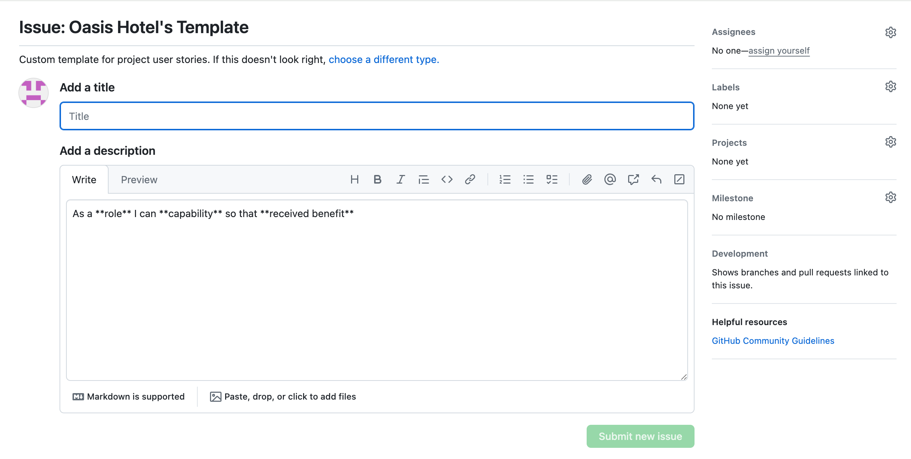
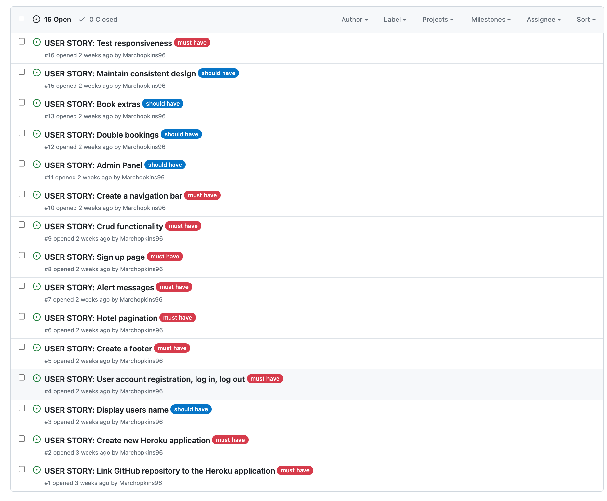
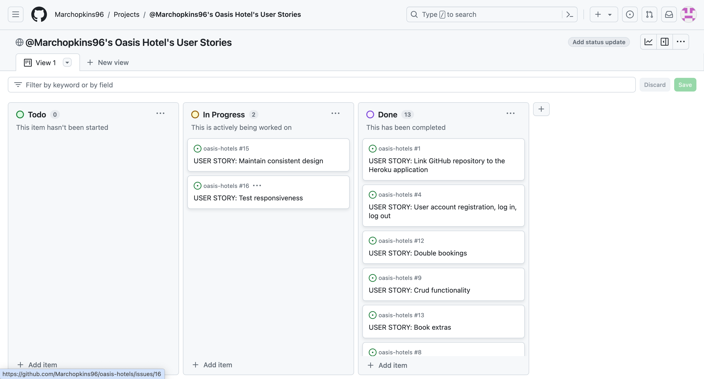

# Oasis Hotels

Our Django based website is a platform for users to explore and book a wide range of hotels. Oasis Hotels is an exclusive selection of stunning fine hotels and resorts spread all around the globe. Each one is unique, offering a combination of charm, character, and luxury. Also, they are all in excellent locations, whether you are looking for a quiet getaway or want something for the whole family.

[View Oasis Hotels live website here](https://oasis-hotels-a4728551ae39.herokuapp.com/)

## User Experience

Our website offers the user intuitive navigation, eye catching visuals, and a quick and easy booking process. Oasis Hotels website can be accessed on a range of devices making it easy to make a booking on the device of your choice. Discover your next holiday destination with Oasis Hotels here to make that proccess as enjoyable and stress free as possible.

### Agile Methodology

Agile was used to help prioritize and organise the tasks that related to the creation of the project. User stories and Project Boards on GitHub providing the tools to do this. A template was created to help create user stories.

* User stories were created based on what will be included, should be included and could be included.
* Project Board is set to public view
* Project Board was used to track the project progress through the Todo, In progress and Done columns
* Labels used to catergorise issues based on importance

 User Stories Template

 User Stories, Issues

 Project Board

### User Stories

1. Initial Deployment 
* Create a new Heroku application
* Link GitHub repository to the new Heroku app
2. Home Page
* Create a navigation bar
* Create a footer
3. User Registration
* Sign up page
* User registration, log in, log out functions
* Username displays on screen
4. Website Admin and Bookings
* Alert messages
* CRUD functionality
* Hotel pagination
* Admin panel
* Double bookings
* Book extras
4. Maintain consistent design with responsiveness in mind
* Maintain consistent design throughout the website
* Test responsiveness

For a more detailed look at user stories please see [project board](https://github.com/users/Marchopkins96/projects/6)

