# Oasis Hotels

Our Django based website is a platform for users to explore and book a wide range of hotels. Oasis Hotels is an exclusive selection of stunning fine hotels and resorts spread all around the globe. Each one is unique, offering a combination of charm, character, and luxury. Also, they are all in excellent locations, whether you are looking for a quiet getaway or want something for the whole family.

[View Oasis Hotels live website here](https://oasis-hotels-a4728551ae39.herokuapp.com/)

## User Experience

Our website offers the user intuitive navigation, eye catching visuals, and a quick and easy booking process. Oasis Hotels website can be accessed on a range of devices making it easy to make a booking on the device of your choice. Discover your next holiday destination with Oasis Hotels here to make that proccess as enjoyable and stress free as possible.

### Agile Methodology

Agile was used to help prioritize and organise the tasks that related to the creation of the project. User stories and Project Boards on GitHub providing the tools to do this. A template was created to help create user stories.

* User stories were created based on what will be included, should be included and could be included.
* Project Board is set to public view
* Project Board was used to track the project progress through the Todo, In progress and Done columns
* Labels used to catergorise issues based on importance

 User Stories Template

 User Stories, Issues

 Project Board

### User Stories

1. Initial Deployment 
* Create a new Heroku application
* Link GitHub repository to the new Heroku app
2. Home Page
* Create a navigation bar
* Create a footer
3. User Registration
* Sign up page
* User registration, log in, log out functions
* Username displays on screen
4. Website Admin and Bookings
* Alert messages
* CRUD functionality
* Hotel pagination
* Admin panel
* Double bookings
* Book extras
4. Maintain consistent design with responsiveness in mind
* Maintain consistent design throughout the website
* Test responsiveness

For a more detailed look at user stories please see [project board](https://github.com/users/Marchopkins96/projects/6)

### Target Audience

* Couples & families planning their next getaway in the sun
* People who like to book things quickly and easily
* Mobile users who enjoy conveniently booking from their device
* People who enjoy a visually appealing experience

### First time user

* Users are greeted with a simple and intuitive navigation bar making it easy to explore the website
* Users are drawn in by eye catching color and design 
* content dispaying an overview of the company and what it has to offer a user
* Forms are easy to naviagate with clear validation messages to ensure accurate information in inputted
* quick and easy registration process

### Registered User

* Login process is quick and easy to navigate
* username displayed once logged in
* Browse available hotels
* Booking of hotels
* Ability to view booking history and any upcoming reservations
* Easily delete or modify bookings

### Admin user

* Secure login portal for admin users who have the rights to access it
* Access to the admin dashboard to manage hotels, extras and bookings
* Ability to add, edit and delete hotel listings
* Ability to add, edit and delete extras options
* Delete user accounts, providing the necessary control for managing user data
* Management of bookings, abiliity to view, delete or modify bookings

## Design

The Oasis Hotels website is invitiing and visually pleasing. Boasting a warm color pallette to give the feeling of a warm summers evening. The navigation bar features a company logo with clear easy to read textual content. Hotel photos are displayed in a bordered carousel to aid the user experience. The about section is placed on a white background the contrast the background of the home page nicely. Social links are featured in the footer section.

### Color Scheme

### Hotel Images 

All the hotel images were created using Artificial Inteligence, AI image generator [Craiyon](https://www.craiyon.com/)

### Logo 

The Logo was also created at [Craiyon](https://www.craiyon.com/)

### Typography 

The 'Quicksand' font is the primary font used with 'Serif' provided as a back up

### Wireframes 

 Home Page

 Home Page when logged in

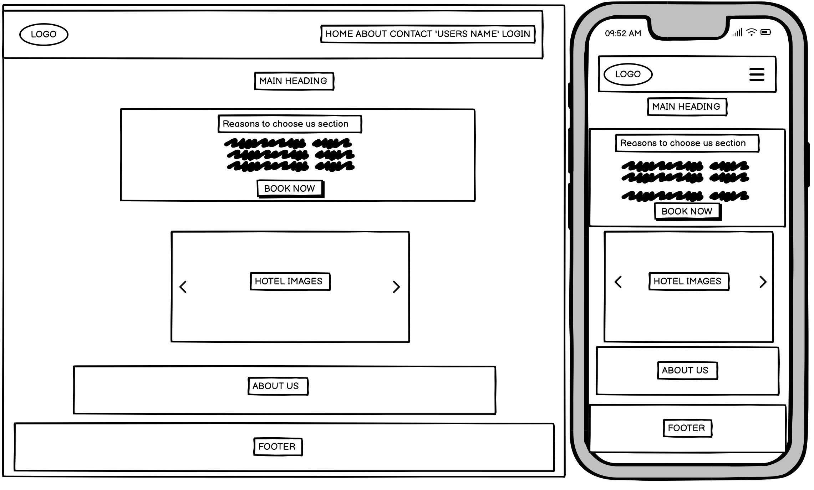

 Contact Page

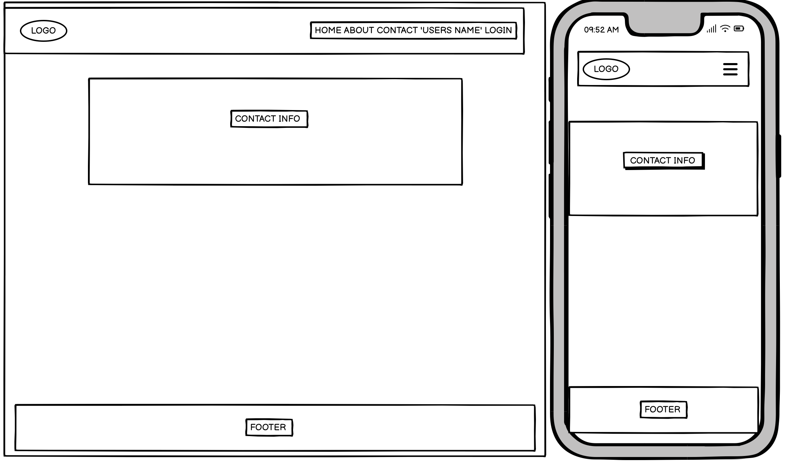

 Hotel Booking Page

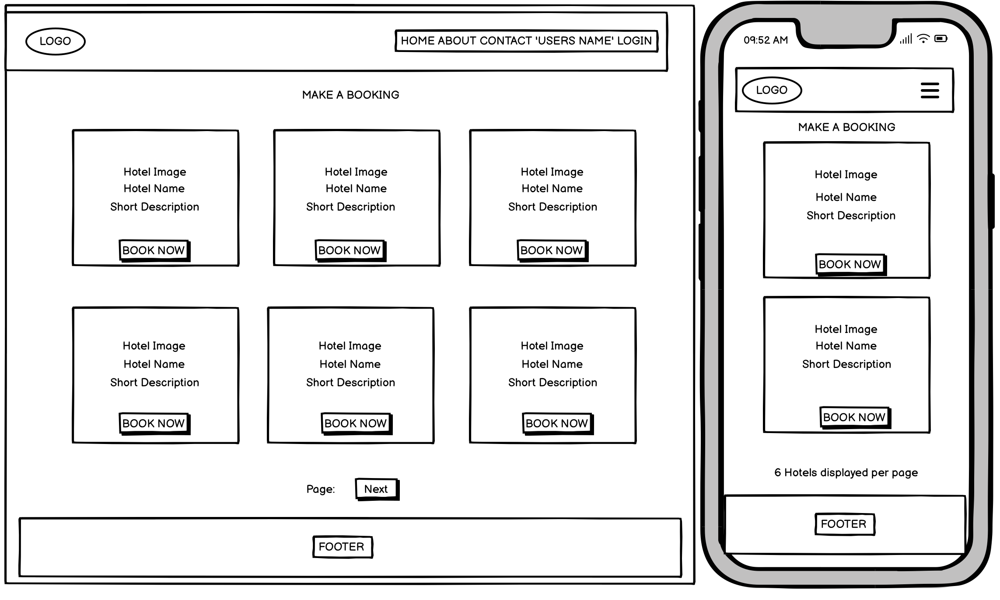

 Make a Booking Page

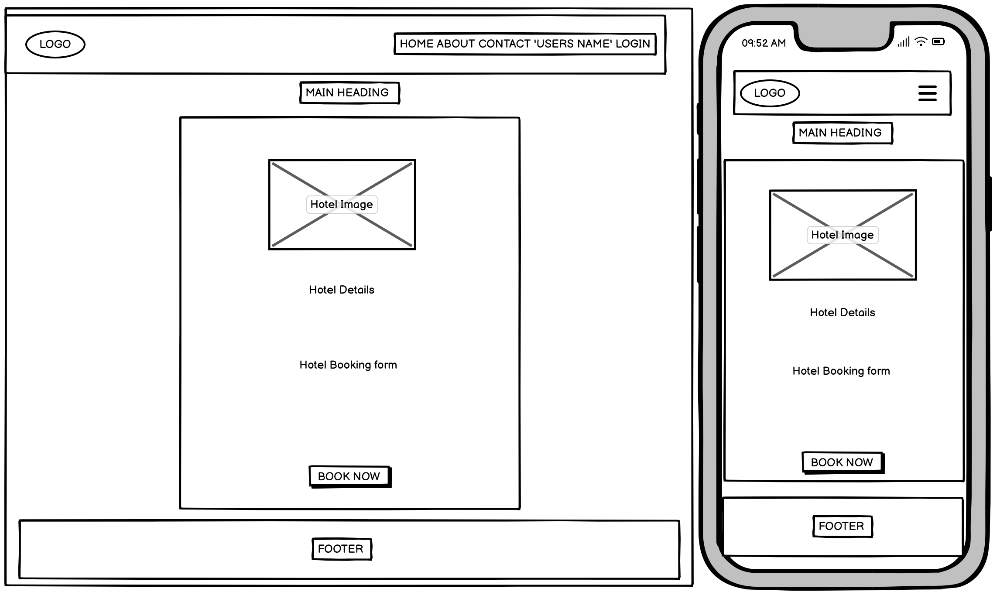

 My Booking Page

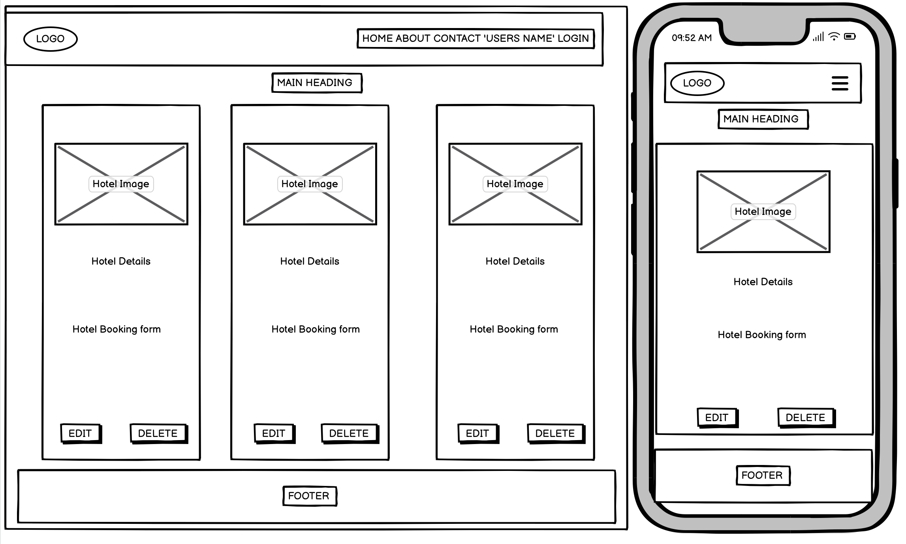

 Edit Booking Page

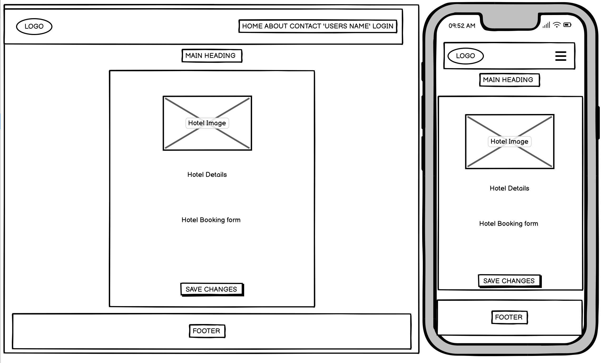

 Delete Booking Page

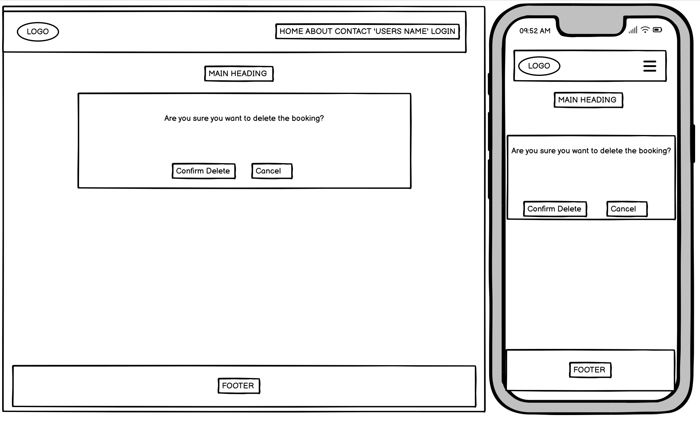

 User Login Page

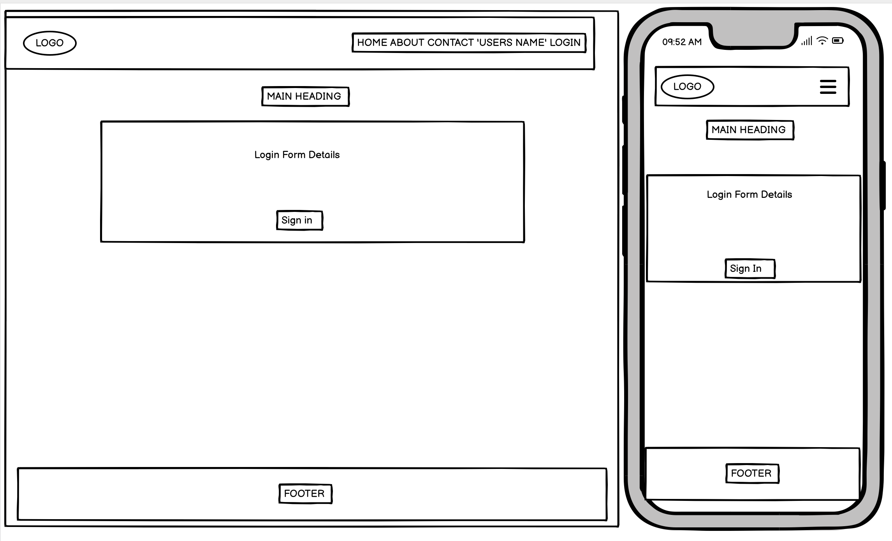

 User Logout Page

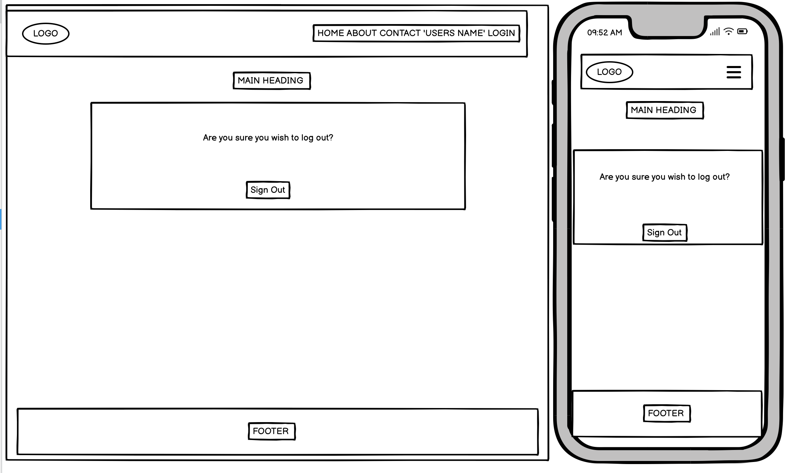

 User Sign Up Page

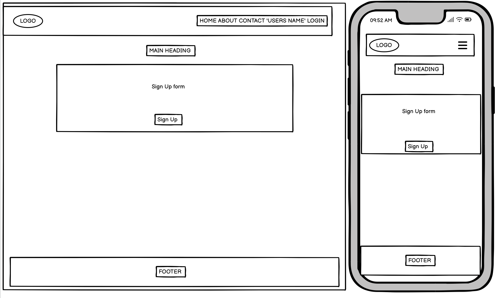

### Data Models

1. AllAuth User Model
    * Django Allauth, the User model is the default user model provided by the Django authentication system
    * The User entity has a one-to-many relationship with the Booking entity. This means that a User can have multiple Bookings, but each Booking is associated with only one User.
---
2. Extras Model
    * Data model created so admin can add extras to the hotel booking, and control the names of extras
    * Only Admin can change the data in the backend.
    * User can book those extras through the Booking Model
    * An extra can be associated with multiple Hotels, and a Hotel can have multiple extras. This is represented by the many-to-many relationship between Extras and Hotel.
    * There are two extras set up, which are breakfast included and kids club tickets
---
3. Hotel Model
    * A Hotel can have multiple Bookings, but each Booking is associated with only one Hotel. This is represented by the foreign key relationship between Hotel and Booking.
    * Admin can add Hotels through djangos admin panel.
    * Only Admin can change the data in the backend.
    * User can see the hotel information and image based on the chosen hotel.
    * Information provided is image, description, maximum guests, extras
---
4. Booking Model
    * A User can have multiple Bookings, but each Booking is associated with only one User. This is represented by the foreign key relationship between User and Booking.
    * Booking model has a feature that prevents overlapping bookings, so users dont book on the same dates
    * Full CRUD functionality is available to the user.
    * User in order to book has to fill check-in, check-out dates, number of guests and optional extras
    ---

### Database Scheme

Entity Relationship Diagram (ERD)

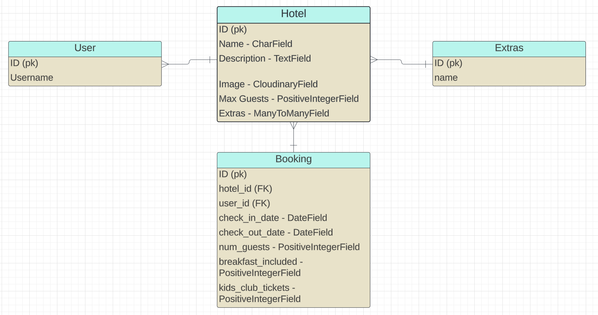

* The Extras entity represents extras that can be associated with hotels, with fields id as the primary key, name for the extras's name
* The Hotel entity represents individual hotel listings, with fields id as the primary key, name for the hotel's name, description for the hotel's description, image for the hotel's image and max_guests for the maximum number of guests allowed
* The Booking entity represents a booking made by a user for a specific hotel, with fields id as the primary key, hotel_id as a foreign key referencing the Hotel entity, user_id as a foreign key referencing the User entity, check_in_date for the booking's check-in date, check_out_date for the booking's check-out date, num_guests for the number of guests in the booking, breakfast_included for the optional quantity of breakfast's included, kids_club_tickets for the optional quantity of kids club tickets within the booking.

This data scheme allows for the management of users, extras, hotels, and bookings. Users can make bookings for specific hotels, and each booking can have associated details such as the check-in and check-out dates, number of guests, and optional extras.

## Security Features 

### User Authentication

* Django Allauth is a popular authentication and authorization library for Django, which provides a set of features for managing user authentication, registration, and account management.

### Login Decorator

* booking_create, booking_success, booking_overview, edit_booking, and delete_booking: These views involve operations related to user bookings and require authentication with the login_required decorator.
* This ensures that only authenticated users can access these views.

### CSRF Protection

* Django provides built-in protection against Cross-Site Request Forgery (CSRF) attacks. CSRF tokens are generated for each user session, and they are required to submit forms or perform state-changing actions. When a user logs out, the session and associated CSRF token are invalidated, making it difficult for an attacker to forge a valid request using a copied URL.

### Form Validation

* The booking_create view validates form input using the BookingForm class. It checks for various validation errors, such as the number of guests, check-in and check-out dates, overlapping bookings, and additional validations for breakfast incldued and kids club tickets

### Overlapping Booking

* In the booking_create view, the code checks for overlapping bookings by querying the database for existing bookings that match certain conditions. It compares the selected check-in and check-out dates with the dates of existing bookings for the same hotel. If any overlapping bookings are found, an error message is added to the form, and a warning message is displayed to the user

### Custom error pages

* 404 Error Page, provides user with a button the redirect to home page
* 500 Error Page, provides user with a button the redirect to home page

## Features

* Home page showcases a rotating carousel that contains the hotels available
* The Home page features a reasons section stating why to choose Oasis Hotels with an about section at the bottom of the page
* User can make an account and login
* When logged in, users get access to the hotel overview and are able to book hotels
* Users can edit and delete their bookings
* Every user action is accompanied by a corresponding message to ensure that users are promptly notified of any changes or updates

### Existing Features

* Home Page
    * Displays a navigation bar with logo, main heading, reasons section, carousel of hotels available, about section, footer with social links

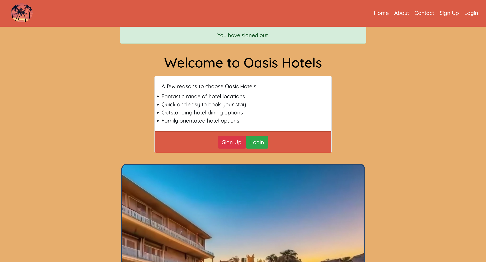

* Once a user is logged in the Sign Up button changes to Book Now button

* Logo
    * Logo was created using [Craiyon](https://www.craiyon.com/) AI image generator, palm trees and sun being the key words

* Navigation Bar
    * It differs depending on if its a user, admin or just a visitor visiting the site

    * Navigation bar for a visitor

    

    * Navigation bar for a user
    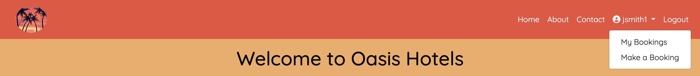
    * Drop down menu allows users to make a booking and view existing bookings

    * Navigation bar for admin
    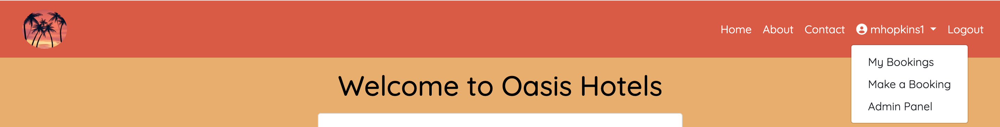
    * Admin bar accessible via dropdown option

* Reasons section
    * Section with a few reasons on why a user should use Oasis Hotels

    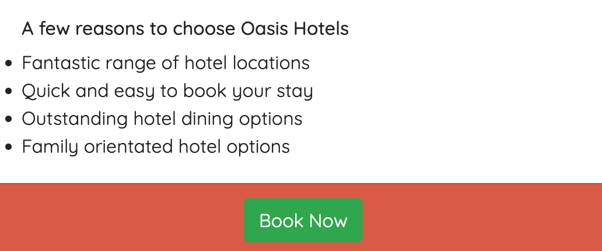

* Hotel Carousel
    * When on home page there is a carousel that displays all available hotels for booking, it also has controls to move left or right, name and description of the hotel, when its clicked it redirects users to hotel overview page and visitors are asked to create an account or login in order to view the hotels in more detail.

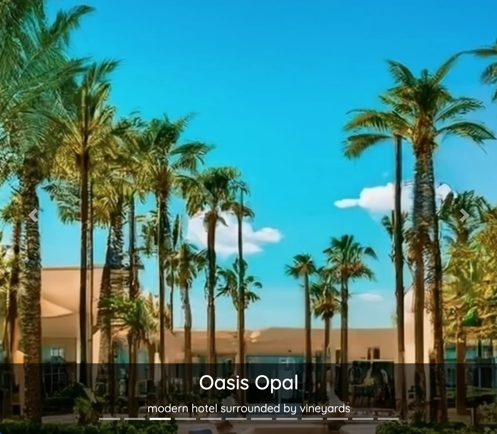

* About Section
    * It contains a description about Oasis Hotels

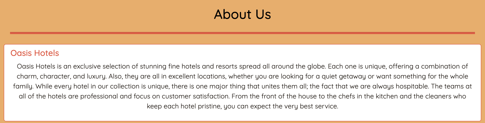

* Footer
    * Contains copyright information, creator and social links

* Contact Page
    * For educational purposes, the website includes fictional contact information such as an address, phone number, and email.

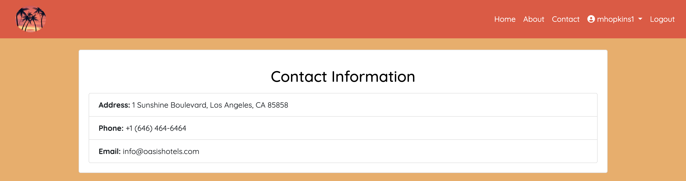

* Sign up
    * User can create an account

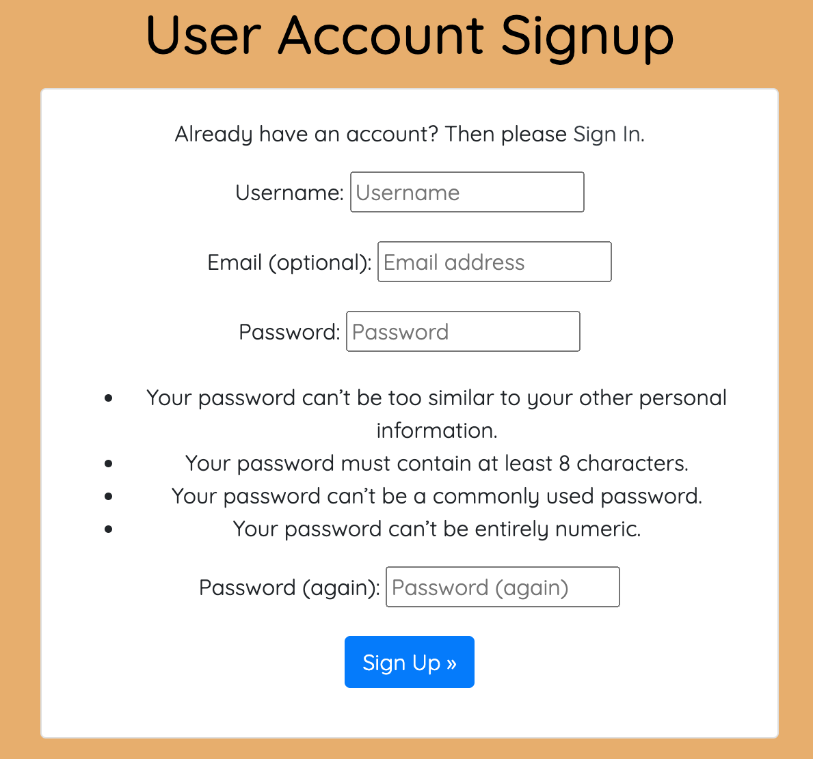

* Login
    * User can login into an account, if they have created one

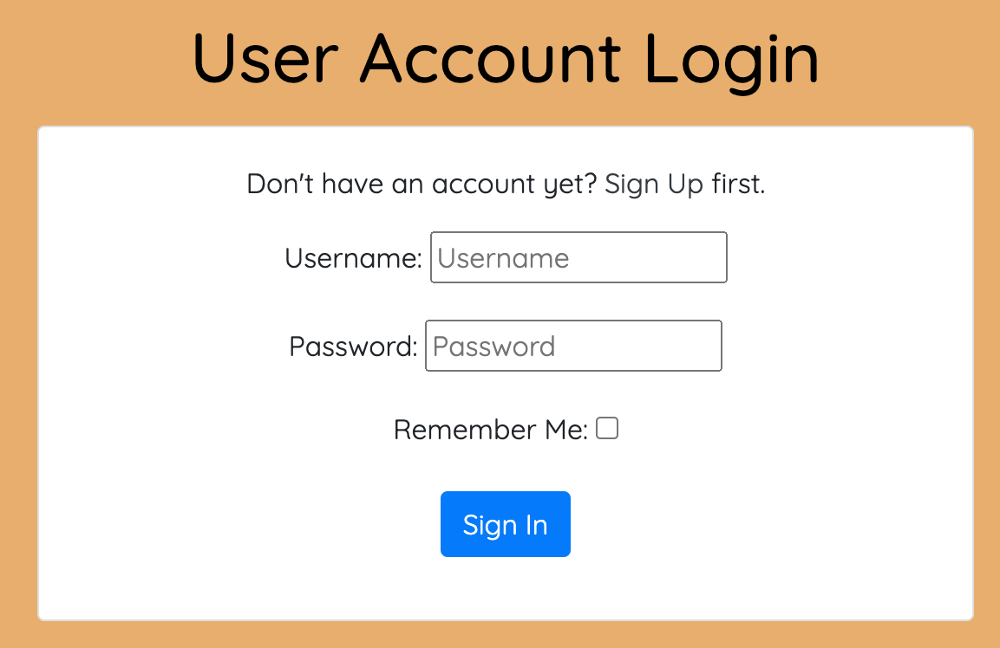

* Browse Available Hotels
    * Admin can create hotels through django admin panel
    * Hotels are paginated to display 6 hotels per page

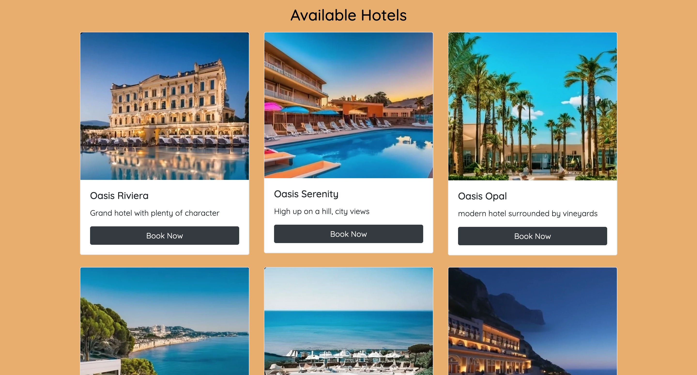

* Hotel pagination
    * On the bottom of the page

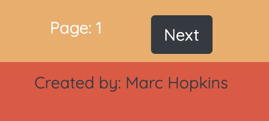

    

