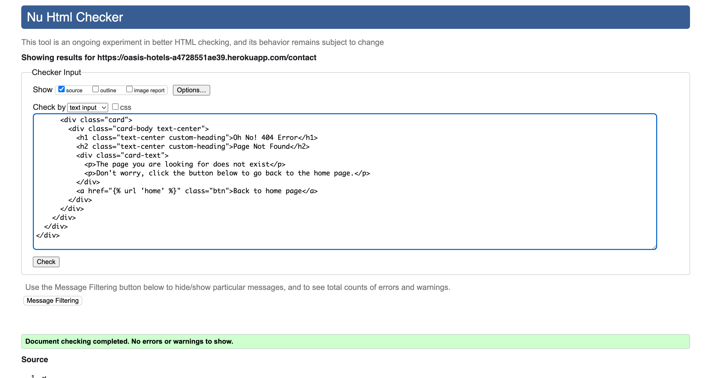
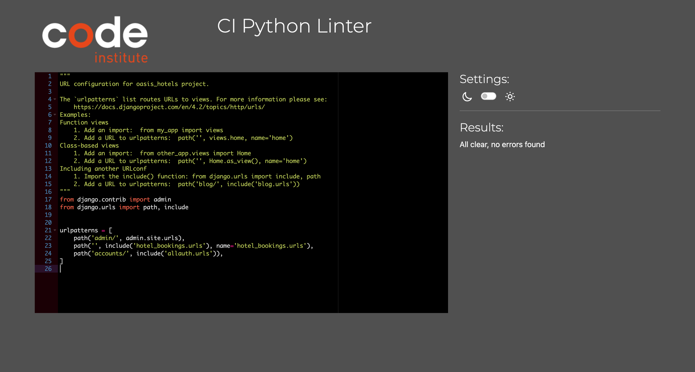

# Welcome to Oasis Hotels Testing 

Return to [README](#README.md)

Comprehensive testing has been performed to ensure the website's functionality meets expectations.

## Responsiveness Testing

The deployed website underwent testing on multiple devices and screen sizes to ensure its responsiveness and adaptability. Chrome Developer Tools were utilized to simulate various screen sizes. Bootstrap classes and media queries were implemented to help achieve the desired design, ensuring that the website maintains its visual and functional integrity on all platforms, in turn enhancing the user experience.

 Desktop PC

 Laptop

 Tablet

 Mobile

## Browser  and Device Compatibility Testing

The project was tested on multiple web browsers to check for compatibility issues and ensure it functions as expected no matter the browser used. This testing process ensures that users will have a smooth and consistent user experience.

The site has been tested on the following browsers & devices:
* Google Chrome
* Safari
* Microsoft Edge
* Mozilla Firefox
* Iphone 12 Safari

The site functions as expected on all of the above browsers. I have tested the site on all browsers ans devices at my disposal to ensure the site is functional on different devices and platforms.

## Code Validation 

### HTML Validation

 Home Page

 Contact Page

 Sign Up Page

 Login Page

 Logout Page

 Browse Hotels Page

 Make a Booking Page

 Booking Success Page

 Booking Overview Page

 Edit Booking Page

 Delete Booking Page

 404 Error Page

 500 Error Page

 

### CSS Validation

 Custom CSS (style.css)

### JavaScript Validation

 Custom JS (script.js)

 Edit Booking Inline Script

 Make a Booking Inline Script

### Python Validation 

#### hotel_bookings app

 admin.py

 forms.py

 models.py

 views.py

 urls.py

#### oasis_hotels app

 settings.py

 urls.py

## Lighthouse Report

 Home Page

 Home Page Logged in

 Contact Page

 Sign Up Page

 Login Page

 Logout Page

 Browse Hotels Page

 Make a Booking Page

 Booking Success Page

 Booking Overview Page

 Edit Booking Page

 Delete Page

